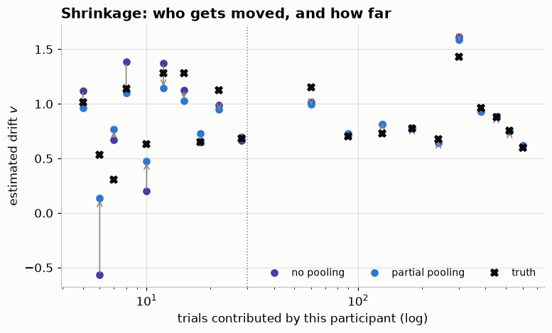
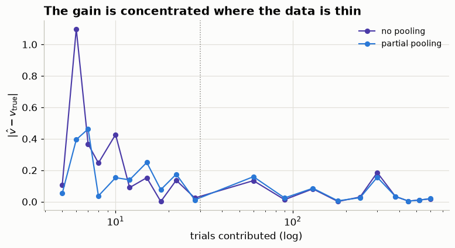
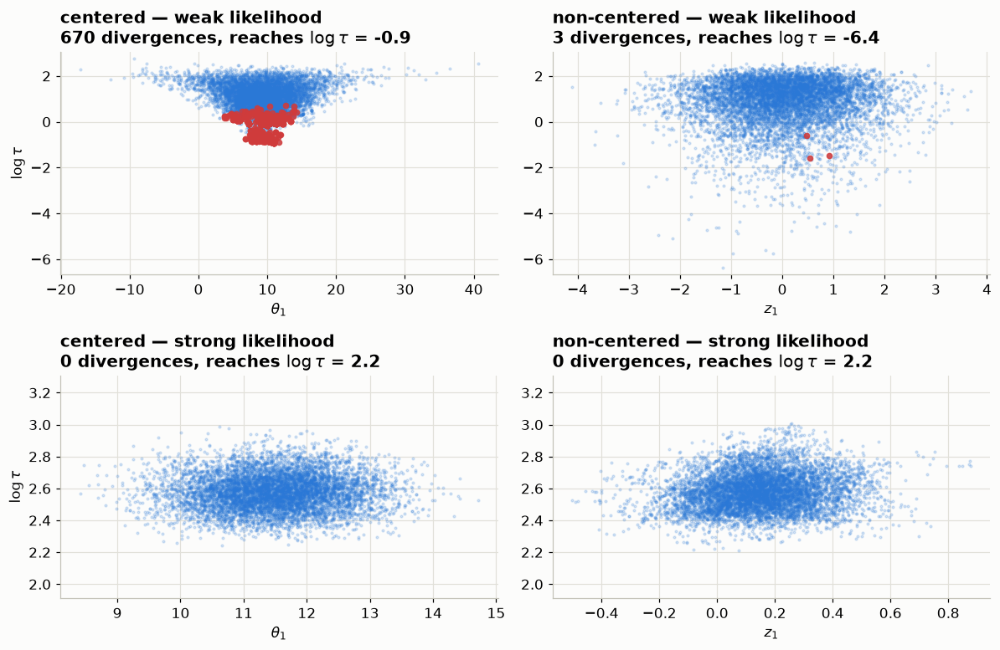

## Three ways to model 20 participants

::: {.incremental}
- **Complete pooling** — one set of parameters for everyone.
  Cheap, and wrong the moment participants actually differ.
- **No pooling** — a separate fit per participant.
  Honest about differences, terrible for participants with little data.
- **Partial pooling** — participants are draws from a population.
  Each estimate borrows strength from the others.
:::

. . .

Partial pooling is the one we want. It is also the one that changes the
*geometry* of the posterior.

## Where the three differ, in Bayes' rule

For one participant there is nothing to argue about:

$$p(\theta \mid y) \;=\; \frac{p(y \mid \theta)\, p(\theta)}{p(y)}$$

. . .

With $G$ participants and trials $i$ within each, **the whole argument is about
$p(\theta)$**:

$$
p(\theta_{1:G},\, \phi \mid y) \;\propto\;
\prod_{g=1}^{G} \left[ \prod_{i=1}^{n_g} p(y_{gi} \mid \theta_g)
\;\cdot\;
p(\theta_g \mid \phi) \right]
\;\cdot\;
p(\phi)
$$

| term | what it is |
|---|---|
| $\prod_i p(y_{gi} \mid \theta_g)$ | **likelihood** — trial $i$ of participant $g$ |
| $\prod_g p(\theta_g \mid \phi)$ | **population** — where participants come from |
| $p(\phi)$ | **hyperprior** |

## The same equation, three ways

| | population term $p(\theta_g \mid \phi)$ |
|---|---|
| complete pooling | a point mass — every $\theta_g$ is the same $\theta$ |
| no pooling | a fixed, wide prior, **identical and independent** for each $g$ |
| partial pooling | a distribution whose $\phi$ is **estimated from the data** |

. . .

::: {.callout-note}
## Hierarchy is not a new inference rule
It is the ordinary posterior with one extra layer in the prior. What changes is
that participants stop being independent: each one's estimate now depends on
what the others said, through $\phi$.
:::

## Does it actually help? Let us check

A DDM panel built to be **unbalanced**, the way real data is:

- 20 participants, each with their own drift $v_g$ drawn from a population
- trial counts from **5 to 600** — some participants barely showed up
- everything else held fixed, so the comparison is about pooling alone

. . .

Fit it twice — **no pooling** and **partial pooling** — and compare each
estimate against the drift we know we used.

## Pooling moves whoever cannot speak for themselves



Each arrow is one participant, from their no-pooling to their partial-pooling
estimate. Long arrows on the left. Almost none on the right.

## The gain is exactly where the data is thin

::: {.columns}
::: {.column width="55%"}

:::
::: {.column width="45%"}
| mean abs. error | no pooling | partial |
|---|---|---|
| **fewer than 30 trials** | 0.265 | **0.175** |
| 30 trials or more | 0.051 | 0.052 |
:::
:::

. . .

**34% better where data is scarce, and no worse where it is plentiful.** That is
the trade you are being offered — and there is essentially no downside side of
it.

## Why that happens

With 5 trials, a no-pooling fit has almost nothing to go on, so its estimate
falls back on **whatever prior you happened to write down**.

. . .

Partial pooling also falls back on a prior — but on the **population**, which
was estimated from the participants who *did* have data.

::: {.callout-note}
## The one-sentence version
Pooling replaces an arbitrary prior with an *earned* one.
:::

## Wait — did we not just add parameters?

The panel you just saw, counted naively:

| Model | Free parameters |
|---|---|
| Complete pooling | 1 |
| No pooling | 20 |
| Partial pooling | 20 + $\mu$ + $\tau$ = **22** |

. . .

Partial pooling has **more** parameters *and* generalised better. Either
Occam is wrong, or we are counting the wrong thing.

## First: what is `p_loo`?

An **estimate of how many parameters your model is effectively using**, and it
is measured, not counted.

. . .

The idea: compare how well the model predicts the data it **was fitted on**
against how well it predicts data it **has not seen** (estimated by
leave-one-out cross-validation):

$$p_{\text{loo}} \;=\; \text{(fit to the data you have)} \;-\;
  \text{(predicted fit to data you do not)}$$

. . .

A model that is very flexible fits what it saw much better than what it did
not — a **big gap**. A rigid model fits both about equally — a **small gap**.
That gap is the price of flexibility, denominated in parameters.

::: {.callout-note}
## Note
For a simple model with flat priors, `p_loo` lands near the actual parameter
count. Anything that **constrains** parameters — a prior, or a hierarchy —
pushes it below.
:::

## Count what the parameters cost, not how many there are

`p_loo` — the **effective** number of parameters — measured on those exact two
fits:

| | nominal | effective (`p_loo`) |
|---|---|---|
| no pooling | 20 | **19.2** |
| partial pooling | **22** | **15.1** |

. . .

Two more nominal parameters. **Four fewer effective ones.**

::: {.callout-important}
## Why
A parameter costs a full unit only if the data is free to put it *anywhere*.
Under pooling, each $v_g$ is pulled toward $\mu$ — so it is no longer free, and
it costs a **fraction** of a parameter.
:::

## The two extra parameters are not two full extra degrees of freedom

They are two **knobs that remove freedom** from the other twenty.

. . .

$\tau$ is a regularisation strength — and it is **learned from the data**
rather than guessed by you. That is the trade the hierarchy makes:

$$\text{2 hyperparameters} \;\longrightarrow\; \text{20 parameters that each cost less than 1}$$

. . .

You could have written a tight prior on $v_g$ by hand and got the same
regularisation. You would have had to **guess its width**. The hierarchy
estimates that width from the data instead.

## An honest footnote on `p_loo`

::: {.callout-warning}
## The gap depends on how sparse your groups are
Our panel has participants with **5 trials** — those get shrunk hard, which is
where the 19.2 → 15.1 comes from.

Run the same comparison where *every* participant has 600 trials and the gap
nearly vanishes: each participant's own data identifies their drift, shrinkage
has nothing to pull against, and `p_loo` sits close to the nominal count.
:::

Also note `elpd_loo` was **a tie** (−3984 vs −3983). Trial-level LOO is
dominated by the participants who had plenty of data. Fewer effective
parameters, same trial-level prediction — the benefit showed up in the
*estimates*, which is what the previous slides measured.
. . .

## Hierarchical models have benefits
### Now we look at some of the problems...

. . .

## The geometry changes meaningfully

The population scale $\tau$ and the participant offsets $\theta_g$ are coupled:
small $\tau$ forces every $\theta_g$ into a narrow band.

The posterior is a **funnel** — wide at the mouth, arbitrarily narrow at the neck.

::: {.callout-important}
## The problem is not the shape, it is the curvature
No single step size is both *stable* in the neck and *efficient* in the mouth.
That is what breaks the sampler.
:::

## How narrow is the neck?

The conditional width of a group parameter is $e^{\tau/2}$:

| $\tau$ | conditional SD | relative to $\tau = 2$ |
|---|---|---|
| $2.0$ | $2.72$ | 1× |
| $0.0$ | $1.00$ | 2.7× narrower |
| $-4.0$ | $0.135$ | 20× narrower |
| $-8.0$ | $0.018$ | **150× narrower** |

. . .

A leapfrog step size stable at the bottom is uselessly small at the top. One
global step size has to serve both.

## Poll

> Your hierarchical model reports $\hat{R} = 1.00$ and ESS in the thousands,
> with 40 divergences. Inspecting the posteriors, you notice there seems to be
> a **funnel shape**. What should you conclude?

. . .

> **A.** It converged; divergences are a performance warning.
>
> **B.** Run it longer.
>
> **C.** Raise `target_accept` until they go away, then trust it.
>
> **D.** The estimates may be biased, and none of the above fixes that.

. . .

**D.** Divergences signal that the integrator failed in a region the chain
therefore *systematically under-visits*. The chain is not slow, it is wrong —
and $\hat{R}$ cannot see it, because every chain fails the same way.

## The fix is a change of coordinates

::: {.columns}
::: {.column width="50%"}
**Centered**

$$\theta_g \sim \text{Normal}(\mu, \tau)$$ \


Sample $\theta_g$ directly. Its scale depends on $\tau$ — that coupling *is*
the funnel.
:::
::: {.column width="50%"}
**Non-centered**

$$z_g \sim \text{Normal}(0, 1)$$
$$\theta_g = \mu + \tau \cdot z_g$$

Sample $z_g$, whose *prior* knows nothing about $\tau$.
:::
:::

. . .

Same distribution. Different **coordinates**. The sampler only ever sees the
coordinates.

## Careful: the coupling did not vanish

A priori, $z_g$ is an isotropic unit Gaussian — genuinely a ball. But the
coupling to $\tau$ has not been removed, only **moved**:

$$\theta_g = \mu + \tau \cdot z_g \quad \leftarrow \text{ the likelihood still sees this}$$

. . .

::: {.callout-important}
## The sentence to remember
**Centering puts the funnel in the prior. Non-centering moves it into the
likelihood.** Whichever of the two is *weaker* for a given group should be the
one carrying it.
:::

## But not always

::: {.callout-important}
## "Always non-center" is wrong
Which parameterization wins depends on whether the **prior** or the
**likelihood** dominates each group.
:::

- **few observations per group** → prior dominates → **non-centered**
- **many observations per group** → likelihood dominates → **centered**

. . .

With plenty of data per group, the non-centered form develops its *own*
funnel — an **inverted** one: to hold $\theta_g$ fixed while $\tau$ grows, $z_g$
must shrink.

*(Papaspiliopoulos, Roberts & Sköld 2007; Betancourt & Girolami 2013)*

## The pathology swaps corners



## Look at where the blue points *stop*

Both top panels share a $\log\tau$ axis. The centered chain gives up at
$\log\tau \approx -0.9$; the non-centered one carries on to $-6.4$.

| weak likelihood | centered | non-centered |
|---|---|---|
| divergences | **670** | 3 |
| reaches $\log\tau$ | $-0.9$ | $\mathbf{-6.4}$ |
| ESS($\tau$) | **67** | $\mathbf{3491}$ |

. . .

**The centered chain is not sampling the neck badly. It is not sampling it at
all** — and it reports $\hat{R} \approx 1$ while doing so.

## Now strengthen the likelihood

| strong likelihood | centered | non-centered |
|---|---|---|
| divergences | 0 | 0 |
| ESS($\tau$) | $\mathbf{18378}$ | **196** |

. . .

Neither fit diverges now, so the divergence count has nothing to say — and the
ESS has swapped sides by a factor of **94**. Look at the non-centered panel:
$z_1$ and $\log\tau$ are on a hard **diagonal ridge**. To keep $\theta_g$ where
the data wants it while $\tau$ grows, $z_g$ must shrink. That is the inverted
funnel.

::: {.callout-note}
## Why non-centered is still the usual default
Partial pooling itself suppresses the inverted funnel — the more groups
informing $\tau$, the more it is cut off. Betancourt's phrasing: *"the
pathological behavior is the worst exactly when the partial pooling is
strongest."* So the reversal is real, but it usually costs efficiency rather
than correctness.
:::


## The case we are not going to solve today

What if the groups **disagree** about which parameterization they want?

Betancourt's example: 9 groups with
$N = (10, 5, \mathbf{1000}, 10, 1, 5, \mathbf{100}, 10, 5)$.

::: {.incremental}
- Center everything → the *sparse* groups funnel.
- Non-center everything → the two *rich* groups inverted-funnel.
- **Neither monolithic choice is right.** The optimal parameterization is
  per-group.
:::

## …and why it is genuinely nasty

. . .

Both monolithic fits above produced only a **handful** of divergences —
0.015% and 0.005%. Small enough that you would wave them away.

::: {.callout-important}
## The aggregate divergence count hides this
You only see it by plotting $\theta_g$ (or $z_g$) against $\log\tau$
**per group**. The total count looks fine while two groups are broken.
:::

. . .

**There is a fix** — split the groups by a size threshold and parameterize each
half its own way. We are not building it today; it needs per-group surgery on
the model.

## Which is why you want it per parameter

The rule is *per random effect*, and one SSM can hold several that disagree —
because **different parameters are not equally informed by data**,
even from the very same trials.

::: {.incremental}
- **Drift $v$** is informed by *every* trial: each choice and each RT speaks
  to it. Hundreds of trials per participant → **likelihood dominates** →
  centered.
- **Boundary $a$** is identified mostly through the speed–accuracy
  relationship, so it needs *variation* rather than volume — fewer
  effective observations → **prior dominates** → non-centered.
- **A condition effect** present on only a fraction of trials has effectively
  that fraction of the data → **non-centered**.
:::

. . .

Same participants, same trials, different answers:

```python
hssm.HSSM(..., noncentered={"v": False, "a": True})
```

. . .

The heuristic is not "how many trials" but **"how much of the data actually
speaks to this parameter"**.

## Where we are going

1. Build Neal's funnel and watch it fail — **in the notebook**.
2. Reparameterize, and watch it stop failing.
3. Find the crossover where non-centering stops helping.
4. Do it per-parameter, on a real SSM.

. . .

Then the payoff, on the model you would actually fit:

::: {.callout-note}
## The capstone
Drift rate that varies with a **continuous difficulty** covariate, estimated
**per participant**, from a panel where trial counts run from a handful to
several hundred:

$$v_{gi} \;=\; \beta^{(g)}_0 \;+\; \beta^{(g)}_1 \cdot \text{difficulty}_i,
  \qquad \beta^{(g)} \sim \text{Normal}(\mu_\beta, \tau_\beta)$$

Every participant gets their own slope. The participants with 5 trials get one
anyway — borrowed, honestly, from everyone else.

**Result, for participants with fewer than 30 trials: the slope error drops by
about 62%.** A slope needs both trials *and* spread in the covariate, so it is
the first thing to fall apart when data is thin, and the thing pooling rescues
most.
:::

. . .

Everything from here is live in
[`hierarchical-mcmc.ipynb`](hierarchical-mcmc.ipynb).
